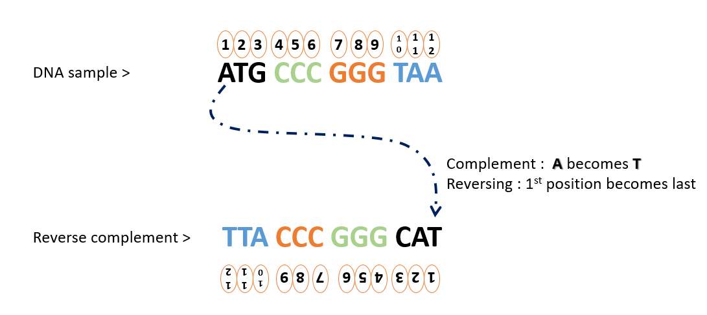

# Prediction of protein coding genes using Markov Models
Given an mRNA sequence, we'll identify which portions of the sequence that produce protein using simple NLP technique, a Markov model.

This was part of a course project for CSEP527 Computational Biology, HW5 (https://courses.cs.washington.edu/courses/csep527/20au/hw/hw5.html).


## Data and Identifying ORFs
Open reading frames (ORFs) are part of the sequences of codons (nucleotide triplets) in our messenger RNA (mRNA) that might be translatable into proteins if the patterns match with real proteins. Given a sequence of codons as shown in the figure below, we could potentially identify ORFs by segmenting the data at "stop codons," which are TAA,TAG, and TGA.


Since a codon is a nucleotide triplet, we have 3 starting points, index 0, index 1, index 2. Then, we segment the data out at the stop codons marked as red in the figure. The figure above identifies start position at "start codons," which is usually ATG.

In our model, we only segment at stop codons. Since there could be variations in terms of start codons, we consider only the stop codons and segment ORFs only at stop positions. i.e. previous stop position to current stop position = approximately one ORF.

We'll be working with genome sequence of Methanococcus jannaschii, a microorganism from "White Smoker" hydrothermal vents shown below. Identified proteins from its genome sequence annotated by CDS data bank will be used as our golden set (caveat: this golden set is like a dev set since we use it to tune our model. this set is not a held-out test set. for a held-out test, we'd likely use another genome sequence).


With ORFs identified, we can now search for the ORFs that actually contain gene coding vs not.

## Markov Model for Protein Predictions

We'll use kth order Markov model for protein prediction. Markov models predict the next letter of nucleotide (k+1th) by previous k letters. So, in case of k=3, the probability of the sequence becomes below.

$P(x) = P(x_1 x_2 x_3) * P(x_4 | x_1 x_2 x_3) * P(x_5 | x_2 x_3 x_4) ... P(x_n | x_{n-3} x_{n-2} x_{n-1})$

Then, we can calculate the probability of given ORF sequences, denoted $P$, and compare with the probability of background, non-gene containing ORF, denoted $Q$. For a non-gene containing ORF, we arbitrarily set these "background" noise sequences to be reverse complement of the identified ORF. Reverse complement is a reverse of the complementary sequence of nucleotides, as shown below. (A is complement of T, G is complement of C).




Then, the log likelihood ratio of $P$ and $Q$ can be used to determine whether an ORF contains a gene, listed in our golden set. The threshold for a protein match was determined by a combination of log likelihood and the length of ORFs, as longer ORFs are likely to contain a gene. The various values of thresholds are more rigorously determined by using ROC curves, plotted in the pdf report.

For detailed MLE approximation and assumptions of conditional probability calculation, please refer to the report HW5_MMs.pdf

## How to run

The train model script will be used for training the markov model, as well as scoring against the golden set and plotting results. The train script can be run as follows:

```
python train_model.py -longl 1400 \
                      -shortl 50 \
                      -k 5 \
                      -pseudo 1
```
`longl` is the length of long ORF frames (i.e. in this case, ORF of length greater than 1400 is considered a long ORF), `shortl` is the length of short ORF frames (i.e. ORFs of length shorter than 50 is considered short ORF), `k` is the markov model parameter, and `pseudo` is the pseudocount added for MLE approximation of probability. 

For more detail, please read the report HW5_MMs.pdf. The report contains run output, detailed MLE approximation calculations and assumptions, plots, and summary of results and findings.
